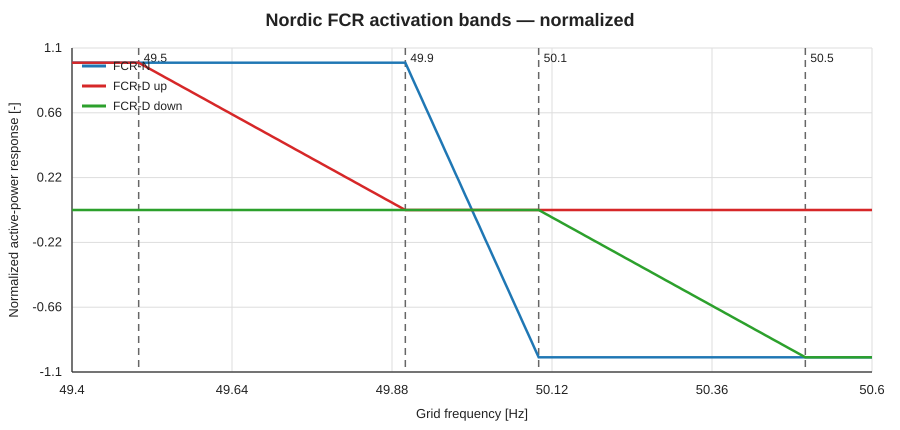
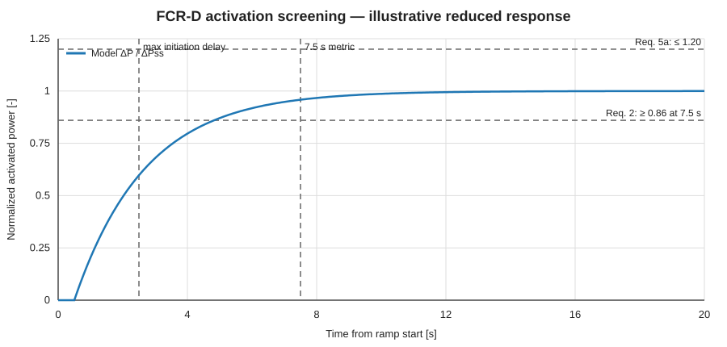
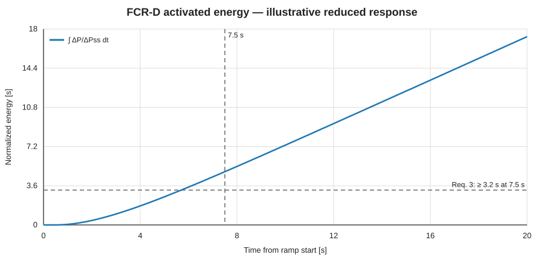
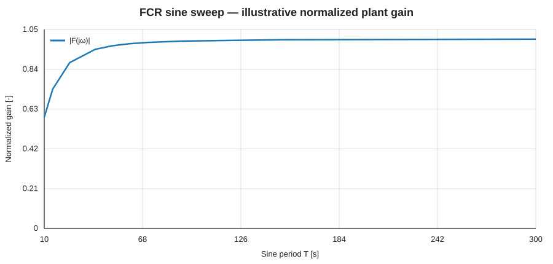
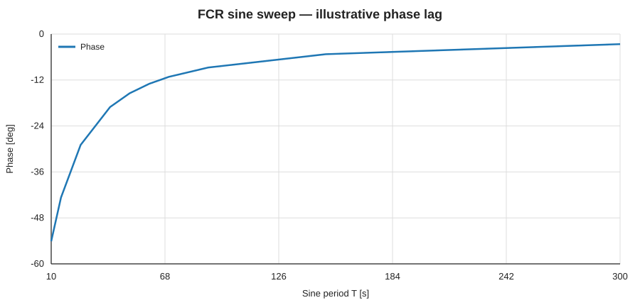
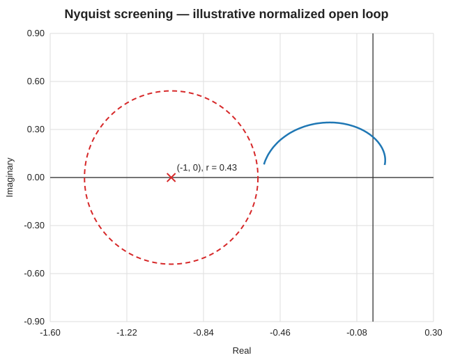

# FCR + FREKI tutorial — Statnett-oriented screening with OpenHPLjl

> Branch basis: `main`  
> Package baseline: `ReducedSMIB` in OpenHPLjl  
> Purpose: turn one nonlinear MTK hydropower model into a practical workflow for FCR screening, model validation, and prequalification preparation.

This tutorial is intentionally compact. It does **not** replace the official Statnett/Nordic prequalification tool or formal TSO approval. Use it to answer one engineering question early:

> **Does this unit/model look technically capable of delivering the requested FCR volume, and where is the limiting mechanism?**

---

## 1. What Statnett is checking

The current Nordic framework used by Statnett requires FCR-providing entities to be prequalified. The Norwegian FCR page points to the common Nordic **Technical Requirements** and **Test Program**. The technical requirements currently published by Statnett are version 2025-03-28.

Current product bands:

| Product | Frequency region | Practical interpretation |
|---|---:|---|
| FCR-N | 49.9–50.1 Hz | normal-operation continuous regulation |
| FCR-D up | 49.9–49.5 Hz | increase production / reduce consumption during low frequency |
| FCR-D down | 50.1–50.5 Hz | decrease production / increase consumption during high frequency |



For 2026, Statnett states that it buys about **230 MW FCR-N each hour** in Norway; FCR-D up is also procured, while FCR-D down is currently not procured in Norway.

Official sources:
- Statnett FCR market page: https://www.statnett.no/for-aktorer-i-kraftbransjen/reservemarkeder/primarreserver/
- Nordic technical requirements: https://www.statnett.no/globalassets/for-aktorer-i-kraftsystemet/marked/reservemarkeder/fcr/pq-dokumenter/technical-requirements-for-frequency-containment-reserve-provision-in-the-nordic-synchronous-area.pdf
- Nordic test program: https://www.statnett.no/globalassets/for-aktorer-i-kraftsystemet/marked/reservemarkeder/fcr/pq-dokumenter/test-program-for-prequalification-of-fcr-in-the-nordic-synchronous-area-v2025-03-28.pdf

---

## 2. FREKI idea in one line

FREKI treats normal power-system disturbances as useful excitation for **continuous model validation**.

Practical workflow:

```text
plant measurements
    ↓
validated nonlinear model
    ↓
FCR test replay in simulation
    ↓
capacity estimate + failure mechanism
    ↓
controller / plant improvement
    ↓
repeat with new measurements
```

The value is not "simulation instead of reality" by default. The value is a continuously verified model that can reduce unnecessary field testing, screen FCR capacity, identify limiting dynamics, and support formal prequalification work.

Project page:
https://www.sintef.no/en/projects/2024/freki/

---

## 3. OpenHPLjl model used here

The current `main` branch contains the reduced closed-loop MTK plant:

```text
Upstream reservoir
   ↓
Headrace
   ↓
Surge tank
   ↓
Penstock
   ↓
ShaftCoupledTurbine
   ↓
LumpedShaft
   ↓
SMIBGenerator
   ↓
InfiniteGrid

shaft speed
   ↓
FrequencySensor
   ↓
DroopGovernor
   ↓
turbine gate
```

The relevant source entry point is:

```julia
using OpenHPLjl
using ModelingToolkit
using OrdinaryDiffEq

@named plant = ReducedSMIB()
compiled = mtkcompile(plant)

prob = ODEProblem(compiled, [], (0.0, 60.0))
sol = solve(prob, Rodas5P())
```

For FCR work, do **not** start by tuning everything. First make the test input explicit.

---

## 4. Add an FCR frequency-test boundary

The normal `InfiniteGrid` fixes 50 Hz. For prequalification-style testing, replace it in the test harness with a grid boundary driven by a signal.

Minimal concept:

```julia
@component function FrequencyTestGrid(; name)
    @named port = ElectricalPowerPort()
    @named f_cmd = SignalSocket()

    eqs = [
        port.omega ~ 2pi * f_cmd.u
    ]

    System(eqs, t, [], []; systems=[port, f_cmd], name)
end
```

Then drive `f_cmd` with:
- FCR-N sine signals,
- FCR-D ramp sequence,
- deactivation profile,
- recorded grid-frequency data.

Keep the physical plant unchanged. Only the external frequency boundary changes.

---

# 5. Test A — steady-state droop / capacity

Before transient metrics, verify the static relation:

[
Delta P_{mathrm{FCR}} approx K_f (f_{mathrm{ref}}-f).
]

For the provider's declared FCR capacity, check:
1. the sign is correct,
2. the response is monotonic,
3. valve/gate limits are not reached,
4. turbine head remains physically valid,
5. generator/shaft limits are respected,
6. the settled power is close to the theoretical response.

For Static FCR-D, the published requirement gives a steady-state tolerance of approximately **-5% under-delivery / +10% over-delivery** for FCR-D up, with reversed asymmetry for FCR-D down.

A useful screening output is:

```text
declared FCR capacity [MW]
simulated steady response [MW]
error [%]
minimum gate margin [%]
minimum head [m]
maximum shaft speed deviation [mHz]
```

---

# 6. Test B — FCR-D activation at 7.5 s

For FCR-D, two central activation metrics are:

[
|Delta P_{7.5s}| ge 0.86|Delta P_{ss,mathrm{theoretical}}|
]

and

[
|E_{7.5s}| ge 3.2,mathrm{s},|Delta P_{ss,mathrm{theoretical}}|.
]

The response initiation delay must not exceed **2.5 s**, and the activation overshoot limit is **20%**.

The plot below is an **illustrative screening response**, not a plant result:



The matching normalized activated-energy integral is:



### Julia metric calculation

```julia
t_eval = 7.5
P0 = sol(0.0, idxs=compiled.generator.Pe)
P75 = sol(t_eval, idxs=compiled.generator.Pe)

dP75 = abs(P75 - P0)

# dense time vector for integration
tv = range(0.0, t_eval, length=2001)
Pv = sol(tv, idxs=compiled.generator.Pe)
dPv = abs.(Pv .- P0)

E75 = sum((dPv[1:end-1] .+ dPv[2:end]) .* diff(tv) ./ 2)

rP = dP75 / dP_theoretical
rE = E75 / dP_theoretical

println("P7.5 / Pss = ", rP)
println("E7.5 / Pss = ", rE, " s")
```

Screening decision:

```text
PASS power metric     if rP >= 0.86
PASS energy metric    if rE >= 3.2 s
CHECK overshoot       max(ΔP) <= 1.20 ΔPss
CHECK initiation      first meaningful response <= 2.5 s
```

---

# 7. Test C — deactivation / excess-energy check

For dynamic FCR-D, Statnett's Nordic technical requirement evaluates excess energy after the nadir/zenith. The stated limit is based on:

[
E_{mathrm{excess}}
le
2.5,mathrm{s},|Delta P_{ss,mathrm{theoretical}}|.
]

For static FCR-D, deactivation rate is additionally constrained; the published requirement includes a maximum average reduction rate of **2.5% of theoretical full response per second over a 10 s window**, with no single 1 s step larger than 20%.

Practical diagnostic:

```text
frequency profile
power response
nadir time
P at nadir
cumulative excess energy
maximum 10-s deactivation slope
largest 1-s drop
```

Do not inspect only `P(t)). Excess energy is often the useful failure signal.

---

# 8. Test D — sine sweep for FCR-N / dynamic FCR-D

The Nordic sine-test periods are:

```text
10, 15, 25, 40, 50, 60, 70, 90, 150, 300 s
```

For FCR-N:
- center frequency = 50 Hz,
- amplitude = ±100 mHz,
- FCR-N active,
- FCR-D inactive,
- challenging loading point,
- high droop.

For FCR-D:
- center = 49.7 Hz for upward reserve or 50.3 Hz for downward reserve,
- amplitude = ±100 mHz,
- low droop,
- challenging loading point.

The current technical requirements recommend using **2–5 stationary periods** to estimate gain and phase.

### Input

[
f(t)=f_c+A_fsin(omega t),qquad omega=rac{2pi}{T}.
]

### Estimated normalized transfer function

[
|F(jomega)|
=
rac{A_P}{A_f}
rac{|Delta f_{mathrm{FCR-X}}|}
{|Delta P_{mathrm{FCR-X,ss,theoretical}}|}.
]

The phase is obtained from the time shift between the input and power response.

Illustrative gain:



Illustrative phase:



These plots are screening examples. Your actual points must come from the MTK simulation or measurements.

---

# 9. Test E — dynamic linearity

For every sine period:
1. remove baseline power,
2. fit a sine with the same period,
3. compare fitted and measured/simulated power,
4. calculate normalized fitting error.

The Nordic requirement evaluates linearity using the RMS fitting residual normalized by the standard deviation of the fitted sine; the required value is **< 1**.

Interpretation for hydropower:
- short-period nonlinearity → servos / deadband / gate-rate effects,
- medium-period nonlinearity → waterway/surge interaction,
- large-amplitude distortion → turbine map or saturation,
- asymmetric response → operating-point dependence.

This is exactly where a FREKI-style validated model is useful: identify whether the mismatch is controller-side or plant-side.

---

# 10. Test F — Nyquist stability screen

The Nordic requirements combine the normalized entity response (F(jomega)) with the specified Nordic power-system model (G(jomega)).

The open-loop quantity used for the stability test is:

[
G_0(jomega)=-F(jomega)G(jomega).
]

The published stability criterion uses a circle centered at ((-1,0j)) with radius **0.43**, with a 95% margin accepted as described in the requirement.

Illustrative screen:



Do not calculate this from an arbitrary control transfer function. Build (F(jomega)) from the same sine-test response used above.

A practical result table should be:

| T [s] | ω [rad/s] | gain | phase [deg] | Re(G0) | Im(G0) | distance to -1 |
|---:|---:|---:|---:|---:|---:|---:|
| 10 | ... | ... | ... | ... | ... | ... |
| 15 | ... | ... | ... | ... | ... | ... |
| ... | ... | ... | ... | ... | ... | ... |
| 300 | ... | ... | ... | ... | ... | ... |

The most important quantity for engineering iteration is often:

```text
minimum distance to (-1,0j)
frequency/period at minimum distance
dominant physical mode at that period
```

---

# 11. FREKI validation loop

A practical FREKI-oriented workflow for OpenHPLjl is:

```text
1. Collect synchronized:
   f_grid(t), P(t), gate(t), head(t), flow(t), speed(t)

2. Select naturally excited windows:
   small frequency events
   dispatch changes
   governor activity
   waterway oscillation events

3. Replay measured f_grid(t) into the MTK test boundary.

4. Compare:
   P_meas vs P_model
   gate_meas vs gate_model
   speed_meas vs speed_model
   head/flow oscillation frequency and damping

5. Estimate uncertain parameters:
   governor Tg
   droop R
   water inertia L/A
   friction
   surge area
   turbine Kq / characteristic map
   efficiency
   damping

6. Re-run formal FCR test signals in simulation.

7. Compute qualified-capacity screening factor.

8. Identify the first active constraint.

9. Propose controller / plant change.

10. Revalidate with new operating data.
```

The important rule is:

> **Do not increase model complexity unless measured residuals justify it.**

---

# 12. Capacity search — the practical engineering output

Instead of asking only "pass/fail?", search the maximum candidate FCR capacity:

```julia
capacities = 0.5:0.5:20.0  # MW example

for C in capacities
    # map C to droop / gain / gate demand
    # run activation test
    # run sine tests
    # evaluate static, dynamic, linearity, stability metrics

    # stop when first requirement is violated
end
```

Return:

```text
maximum screened FCR-N capacity
maximum screened FCR-D-up capacity

limiting requirement:
  steady-state
  P7.5
  E7.5
  overshoot
  deactivation
  linearity
  Nyquist stability
  performance
  gate/rate limit
  hydraulic constraint
```

This is a much more useful FREKI result than a single simulation plot.

---

# 13. Dense output dashboard

For every candidate operating point, keep one compact result block:

| Metric | Result | Requirement / interpretation |
|---|---:|---|
| Candidate FCR-D up | MW | input |
| Steady-state error | % | within relevant band |
| P7.5/Pss | pu | ≥ 0.86 |
| E7.5/Pss | s | ≥ 3.2 s |
| response start | s | ≤ 2.5 s |
| max response/Pss | pu | ≤ 1.20 for relevant activation test |
| excess deactivation energy/Pss | s | ≤ 2.5 s |
| sine linearity index | - | < 1 |
| min Nyquist distance to -1 | - | compare against 0.43 circle |
| minimum turbine head | m | plant constraint |
| maximum gate | pu | actuator constraint |
| maximum gate rate | pu/s | actuator constraint |
| dominant hydraulic period | s | diagnostic |
| model-vs-data NRMSE | % | FREKI validation metric |

---

# 14. Minimum deliverable for Statnett-oriented preparation

A compact engineering package should contain:

```text
01_model.md
  plant architecture
  equations
  parameters
  operating points

02_validation.md
  measurement channels
  time synchronization
  measured vs simulated plots
  fitted parameters
  residuals

03_fcr_n.md
  droop curve
  sine tests
  gain/phase table
  linearity
  Nyquist / performance

04_fcr_d_up.md
  ramp sequence
  P7.5
  E7.5
  overshoot
  deactivation
  endurance
  sine tests if dynamic

05_capacity_screen.md
  tested MW range
  first failing requirement
  recommended qualifying capacity

06_data/
  raw test/measurement export
  processed channels
  metadata
```

Formal prequalification must still use the current Statnett/Nordic procedure and required submission format.

---

# 15. What to implement next in OpenHPLjl

The current `main` branch already has the physical SMIB backbone. The next small additions should be:

1. `FrequencyTestGrid` — externally driven grid frequency.
2. `RampFrequencySignal` and `SineFrequencySignal`.
3. `FCRMetrics.jl` — P7.5, E7.5, overshoot, response delay, deactivation energy.
4. `SineFit.jl` — amplitude, phase, linearity residual.
5. `NordicFCRSystemModel.jl` — official (G(jomega)) calculation.
6. `FCRCapacitySearch.jl` — candidate MW scan.
7. CSV measurement replay for the FREKI validation loop.

Then the package workflow becomes:

```text
ReducedSMIB
   +
measurement replay
   +
FCR test signal
   ↓
MTK simulation
   ↓
Statnett/Nordic metrics
   ↓
FREKI validation
   ↓
qualified-capacity screening
```

---

## One-page engineering interpretation

**If P7.5 fails:** controller/servo/waterway response is too slow.  
**If E7.5 fails but P7.5 passes:** early response area is insufficient.  
**If overshoot fails:** damping/controller aggressiveness is poor.  
**If sine linearity fails:** deadband, saturation, nonlinear turbine/servo effects matter.  
**If Nyquist fails:** response may be fast but destabilizing at a critical frequency.  
**If hydraulic oscillation dominates:** tune governor with waterway dynamics, not as an isolated PID.  
**If model-data residuals are large:** do not trust simulated FCR capacity yet.  
**If all margins are large:** increase candidate FCR MW until the first requirement or plant constraint becomes active.

That first active constraint is the practical output of the FCR + FREKI workflow.
