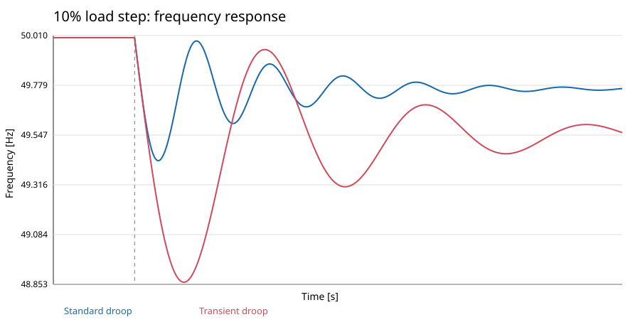
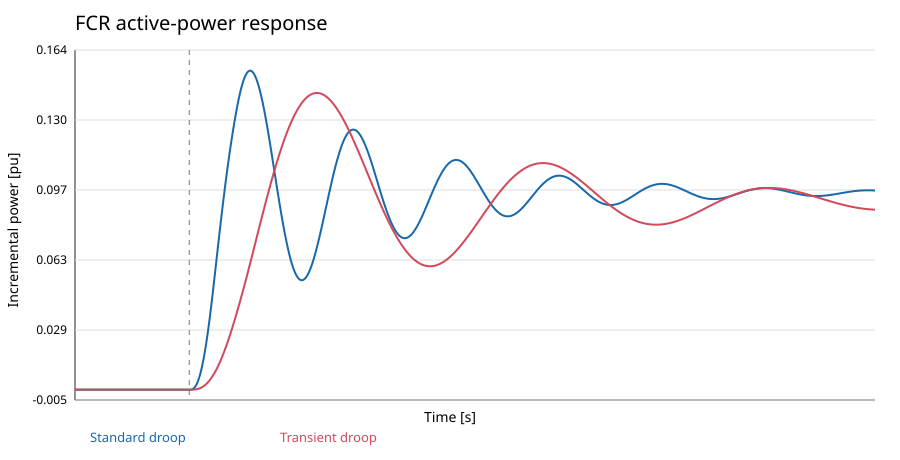

# Compact FCR study

This reduced hydro-unit study screens controller settings before the full nonlinear waterway DAE is used. It is small enough to run as a one-off Railway job and adds no plotting dependency.

## Cases

1. Standard droop versus the OpenHPL-style transient-droop controller for a 10% load increase at 5 s.
2. A six-case sweep of droop and governor/transient time constants.
3. Frequency nadir, time to nadir, maximum activation, and delivered power after 5, 15, and 30 seconds.

The grid balance is `2H d(Δω)/dt = ΔP_m - ΔP_L - D Δω`. The reduced waterway is `T_w d(ΔP_m)/dt = ΔY - ΔP_m`.

## Baseline results

The one-off Railway run completed successfully on commit `71e63b9`.

| Controller | Nadir (Hz) | Time to nadir (s) | Power at 5 s (pu) | Power at 15 s (pu) | Power at 30 s (pu) | Maximum power (pu) |
| --- | ---: | ---: | ---: | ---: | ---: | ---: |
| Standard droop | 49.428161 | 1.460 | 0.053171 | 0.093482 | 0.096289 | 0.154245 |
| Transient droop | 48.863074 | 3.030 | 0.139704 | 0.108662 | 0.087024 | 0.143470 |





The transient-droop case supplies more incremental power at 5 s and 15 s, while the standard-droop case has the higher frequency nadir in this reduced model. Treat that contrast as a prompt for validation with the full OpenHPL waterway model, not as a controller-selection result.

## Reproduce

Run with:

```bash
julia --project=. examples/fcr_compact_study/run_study.jl
```

It writes `timeseries.csv`, `metrics.csv`, `parameter_sweep.csv`, `frequency_comparison.svg`, and `power_comparison.svg` under `results/`. The committed result files correspond to the successful Railway run and make the study reviewable without access to the ephemeral job container.

The 5/15/30-second values are engineering screening metrics, not an official Statnett prequalification verdict. A formal test must use the current product-specific activation profile, measurement rules, tolerances, baseline method, and documentation requirements.
