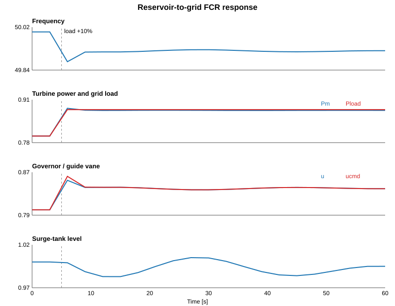

# Reservoir-to-grid FCR study

## Problem

A hydropower plant is connected to an equivalent 50 Hz grid. The model contains the full dynamic path used in this study:

```text
Reservoir -> Headrace -> Surge tank -> Penstock -> Turbine -> Generator/Grid
                                              ^                    |
                                              |                    |
                                              +----- Governor <----+
```

The plant starts at a steady operating point with

- water flow = 0.80 pu,
- guide-vane opening = 0.80 pu,
- turbine power = 0.80 pu,
- grid load = 0.80 pu,
- frequency = 50 Hz.

At `t = 5 s`, grid load increases by 10%:

```text
Pload : 0.80 pu -> 0.88 pu
```

The question is simple: **can the hydro governor increase turbine power fast enough to arrest the frequency drop, while the surge tank and waterway remain dynamically stable?**

## Model

The example is built directly with ModelingToolkit. The main equations are intentionally compact.

Reservoir:

```text
T_res dh_res/dt = q_in - q_h
```

Headrace:

```text
T_h dq_h/dt = h_res - h_s - r_h q_h |q_h|
```

Surge tank:

```text
T_s dh_s/dt = q_h - q_p
```

Penstock and turbine head:

```text
H_t = k_t (q_p/u)^2
T_p dq_p/dt = h_s - H_t - r_p q_p |q_p|
```

Reduced turbine power:

```text
P_m = P_0 (q_p/q_0) (u/u_0)
```

Governor:

```text
u_cmd = clamp[u_0 + (1 - omega)/R]
T_g du/dt = u_cmd - u
```

Grid frequency:

```text
2H d(omega)/dt = P_m - P_load - D(omega - 1)
f = 50 omega
```

The parameters used here are `H = 8 s`, `R = 0.04`, `T_g = 0.30 s`, with separate headrace, surge-tank and penstock time constants.

## Solution

The 10% load step creates an immediate power deficit. Frequency falls, the governor opens the guide vane, penstock flow and turbine power rise, and the surge tank supplies/absorbs the temporary water-flow mismatch.

Representative results from the same equations and parameters are:

| Quantity | Result |
|---|---:|
| Initial frequency | 50.000 Hz |
| Minimum frequency | 49.874 Hz |
| Time of frequency minimum | about 5.9 s |
| Maximum turbine power | 0.899 pu |
| Turbine power at 60 s | 0.878 pu |
| Maximum guide-vane opening | 0.858 pu |
| Minimum surge level | 0.982 pu |
| Maximum surge level | 1.005 pu |
| Frequency at 60 s | 49.921 Hz |

The result shows the FCR mechanism clearly: the governor moves the guide vane, hydraulic flow changes through the surge-tank/penstock system, turbine power increases toward the new load, and the frequency drop is arrested. The remaining steady frequency offset is expected from primary droop control; secondary control/AGC would be needed to restore exactly 50 Hz.

## Result plot



## Run

From the repository root:

```bash
julia --project=. examples/fcr_full_hydro_grid/full_hydro_grid_fcr.jl
```

This is a reduced system-level FCR example. The purpose is to keep the reservoir-to-grid physics visible in one ModelingToolkit model before replacing individual blocks with the higher-detail OpenHPLjl hydraulic components.
