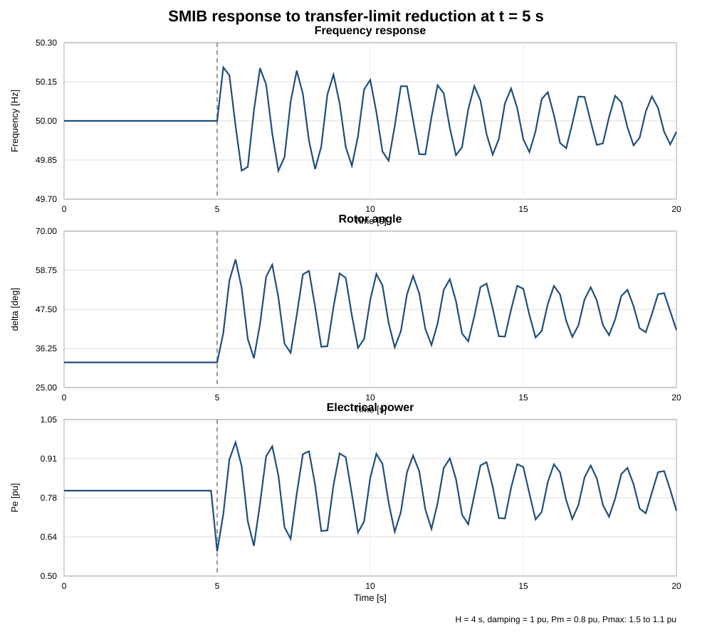

# Single-machine infinite-bus example

This example adds a classical single-machine infinite-bus (SMIB) model to `OpenHPLjl` and uses it to study a sudden reduction in network transfer capability.

## Problem

A synchronous generator is connected to an infinite bus. The infinite bus fixes the reference voltage angle and nominal frequency at 50 Hz. The generator is represented by the classical rotor swing equations.

The electrical power transferred to the grid is

```text
Pe = Pmax sin(delta)
```

where `delta` is the rotor angle relative to the infinite bus.

The rotor dynamics are

```text
d(delta)/dt = omega_b (omega_pu - 1)

2 H d(omega_pu)/dt = Pm - Pe - D (omega_pu - 1)

f = f0 omega_pu
```

with

```text
H       = 4.0 s
D       = 1.0 pu
f0      = 50 Hz
Pm      = 0.8 pu
Pmax,0  = 1.5 pu
```

The pre-disturbance operating point is chosen from

```text
Pm = Pe = Pmax,0 sin(delta0)
```

which gives

```text
delta0 = asin(0.8/1.5) = 32.231 deg.
```

Therefore the machine is exactly in steady state before the disturbance.

## Disturbance

At `t = 5 s` the network transfer limit is reduced:

```text
Pmax : 1.5 pu -> 1.1 pu
```

Mechanical input remains constant at `Pm = 0.8 pu`.

Immediately after the event,

```text
Pe(5+) = 1.1 sin(delta0) = 0.5867 pu < Pm.
```

The positive accelerating power causes the rotor to speed up and the rotor angle to increase. As `delta` increases, electrical power rises again. The machine then exchanges kinetic energy with the infinite bus and exhibits a damped electromechanical oscillation.

## Model topology

```text
       Pm = 0.8 pu
           |
           v
   +----------------+
   | synchronous    |
   | generator      |
   | H = 4 s        |
   +----------------+
       delta, omega
           |
           v
   Pe = Pmax sin(delta)
           |
           v
   +----------------+
   | infinite bus   |
   | f = 50 Hz      |
   +----------------+
```

The reusable ModelingToolkit component is `SMIBGenerator` in `src/ElectroMech.jl`.

Run the example with

```bash
julia --project=. examples/smib/smib_transfer_limit_step.jl
```

## Results



The reference numerical simulation gives:

| Quantity | Result |
|---|---:|
| Initial rotor angle | 32.231 deg |
| Immediate post-event electrical power | 0.5867 pu |
| Maximum frequency | 50.223 Hz |
| Minimum frequency | 49.785 Hz |
| Maximum rotor angle | 61.919 deg |
| Frequency at 20 s | 49.958 Hz |
| Rotor angle at 20 s | 41.568 deg |

The full sampled trajectory is in [`results.csv`](results.csv).

## Interpretation

Before 5 s the generator is in equilibrium: mechanical and electrical power are both 0.8 pu and the frequency is exactly 50 Hz.

Reducing `Pmax` weakens the electrical coupling to the infinite bus. Electrical power falls immediately while mechanical power is unchanged. The rotor therefore accelerates. Frequency rises first, rotor angle increases, and the larger rotor angle then increases transmitted electrical power. The rotor subsequently decelerates and the process repeats as a damped local electromechanical mode.

For this case the rotor angle remains bounded and the oscillation decays, so the machine remains transiently stable. The case is intentionally simple: there is no AVR, excitation dynamics, governor action, turbine-waterway dynamics or network algebraic model yet.

## Why this belongs in OpenHPLjl

`SMIBGenerator.P_m` can later be exposed as an input and connected directly to turbine mechanical power from the nonlinear hydropower model:

```text
Reservoir -> Headrace -> SurgeTank -> Penstock -> Turbine
                                                |
                                                v
                                         SMIBGenerator
                                                |
                                                v
                                           Infinite bus
```

That next configuration will let us study how water inertia, surge-tank oscillations, turbine dynamics and governor action interact with the classical power-system electromechanical mode.

## Files

```text
examples/smib/
├── README.md
├── smib_transfer_limit_step.jl
├── smib_response.svg
└── results.csv
```
